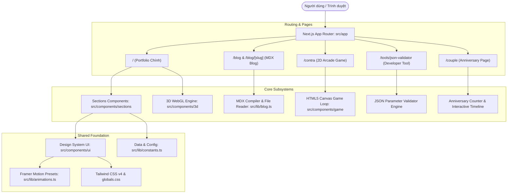
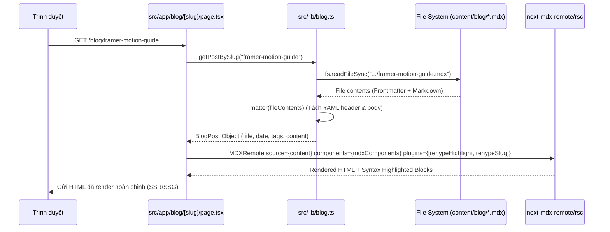

# 🏛️ Kiến Trúc Hệ Thống (Architecture Documentation)

Tài liệu này mô tả chi tiết kiến trúc kỹ thuật, luồng dữ liệu, các phân hệ (subsystems) và nguyên tắc thiết kế của dự án Portfolio.

---

## 1. Tổng Quan Kiến Trúc (Architecture Overview)

Dự án được xây dựng dựa trên **Next.js 14 App Router** với ngôn ngữ **TypeScript** ở chế độ `strict: true`.



---

## 2. Cấu Trúc Thư Mục (Directory Structure)

```
portfolio/
├── .claude/                   # Cấu hình IDE / Claude Code
│   └── settings.local.json
├── content/                   # Dữ liệu nội dung tĩnh ngoài source code
│   └── blog/                  # Các bài viết blog định dạng .mdx
│       ├── framer-motion-guide.mdx
│       └── react-three-fiber-guide.mdx
├── docs/                      # Tài liệu chi tiết của dự án
│   ├── ARCHITECTURE.md        # Kiến trúc hệ thống (file này)
│   ├── FEATURES.md            # Đặc tả chi tiết các tính năng
│   ├── CUSTOMIZATION_GUIDE.md # Hướng dẫn tùy biến nội dung & giao diện
│   └── DEPLOYMENT.md          # Hướng dẫn build và deploy
├── public/                    # Static assets (hình ảnh, icons, resume.pdf)
├── src/                       # Toàn bộ mã nguồn ứng dụng
│   ├── app/                   # Next.js App Router (Routes & Layouts)
│   │   ├── blog/              # Routes trang Blog & chi tiết bài viết
│   │   │   ├── [slug]/page.tsx
│   │   │   └── page.tsx
│   │   ├── contra/            # Route game Contra arcade
│   │   │   └── page.tsx
│   │   ├── couple/            # Route trang kỷ niệm tình yêu
│   │   │   ├── couple.module.css
│   │   │   ├── layout.tsx
│   │   │   └── page.tsx
│   │   ├── tools/             # Route các công cụ tiện ích
│   │   │   └── json-validator/
│   │   │       └── page.tsx
│   │   ├── globals.css        # Tailwind v4 configuration, theme variables & utilities
│   │   ├── layout.tsx         # Root layout chung (Nav, Main, Footer, Fonts)
│   │   └── page.tsx           # Trang chủ Portfolio (One-page scroll)
│   ├── components/            # React Components
│   │   ├── 3d/                # Three.js / React Three Fiber components
│   │   │   ├── FloatingTechStack.tsx
│   │   │   ├── Hero3DScene.tsx
│   │   │   ├── ParticleField.tsx
│   │   │   ├── SceneContainer.tsx
│   │   │   └── index.ts
│   │   ├── blog/              # Components dành cho blog
│   │   │   └── BlogList.tsx
│   │   ├── game/              # Canvas Game Engine
│   │   │   └── ContraGame.tsx
│   │   ├── sections/          # Các section của trang Portfolio chính
│   │   │   ├── AboutSection.tsx
│   │   │   ├── ContactSection.tsx
│   │   │   ├── HeroSection.tsx
│   │   │   ├── ProjectsSection.tsx
│   │   │   ├── SkillsSection.tsx
│   │   │   └── index.ts
│   │   ├── tools/             # Components cho công cụ dev
│   │   │   └── JsonValidator.tsx
│   │   └── ui/                # Reusable UI primitives
│   │       ├── AnimatedSection.tsx
│   │       ├── Button.tsx
│   │       ├── Footer.tsx
│   │       ├── GlassCard.tsx
│   │       ├── Navigation.tsx
│   │       ├── TiltCard.tsx
│   │       └── index.ts
│   └── lib/                   # Utilities, types, constants, logic
│       ├── animations.ts      # Framer Motion animation variants
│       ├── blog.ts            # MDX file reader & parser (Server-only)
│       ├── constants.ts       # Central source of truth cho data & siteConfig
│       ├── types.ts           # TypeScript interfaces & domain models
│       └── utils.ts           # Helper functions (cn helper: clsx + tailwind-merge)
├── CLAUDE.md                  # Hướng dẫn tác vụ dành cho AI Agents / Claude
├── eslint.config.mjs          # Cấu hình ESLint (FlatCompat)
├── next.config.js             # Cấu hình Next.js
├── package.json               # Dependencies & scripts
├── README.md                  # Tài liệu tổng quan dự án
└── tsconfig.json              # Cấu hình TypeScript compiler
```

---

## 3. Các Phân Hệ Chính (Core Subsystems)

### 3.1. 3D WebGL Pipeline (`src/components/3d`)

Phân hệ 3D được xây dựng dựa trên `@react-three/fiber` (R3F), `@react-three/drei` và `three`:

1. **`SceneContainer.tsx` (Wrapper Chuẩn)**:
   - Quản lý khởi tạo `<Canvas>` của Three.js với cấu hình camera tối ưu.
   - **Tự động nhận diện `prefers-reduced-motion`**: Nếu người dùng bật chế độ giảm chuyển động trong hệ điều hành, hệ thống sẽ render Fallback CSS gradient thay vì khởi động WebGL context để tiết kiệm GPU và bảo vệ trải nghiệm người dùng.
   - **`SceneErrorBoundary`**: Bọc toàn bộ 3D scene trong một Error Boundary cấp component. Khi WebGL bị crash hoặc driver GPU không hỗ trợ, màn hình sẽ fallback an toàn mà không làm sập toàn bộ trang web.

2. **Hiệu Suất & Mouse Tracking Không Gây Re-render**:
   - `HeroSection.tsx` sử dụng `useRef` dạng Mutable Object (`mousePositionRef.current = { x, y }`) để lắng nghe sự kiện `onMouseMove`.
   - `Hero3DScene.tsx` đọc trực tiếp giá trị này trong vòng lặp `useFrame((state, delta) => ...)` của Three.js.
   - **Kết quả**: Vị trí chuột được cập nhật mượt mà 60–120 FPS ở tầng GPU/Canvas mà không kích hoạt chu kỳ re-render của React DOM.

3. **Hệ Thống Hạt (`ParticleField.tsx`)**:
   - Sử dụng `THREE.BufferGeometry` với 500 điểm hạt (particle vertices) được cấp phát một lần duy nhất vào bộ nhớ Float32Array.
   - Vị trí các hạt được biến đổi bằng hàm sóng hình sin/cosin trong `useFrame`.

---

### 3.2. MDX Blog Engine (`content/blog` & `src/lib/blog.ts`)

Hệ thống blog hoạt động theo mô hình Server-Side MDX Compilation:



- **Static Generation (`generateStaticParams`)**: Tự động sinh static HTML tại thời điểm build cho toàn bộ các file `.mdx` trong `content/blog/`.
- **Dynamic SEO (`generateMetadata`)**: Tự động trích xuất tiêu đề, mô tả và OpenGraph metadata từ Frontmatter.
- **Custom MDX Components**: Ghi đè toàn bộ các thẻ HTML cơ bản (`h1`-`h3`, `p`, `a`, `pre`, `code`, `blockquote`) bằng giao diện glassmorphic tối đồng bộ với theme của ứng dụng.

---

### 3.3. Canvas 2D Game Loop Engine (`src/components/game/ContraGame.tsx`)

Trang `/contra` chứa một game engine 2D Contra arcade độc lập ~1.800 dòng code:

- **Game Loop (`requestAnimationFrame`)**: Chạy độc lập với React state, cập nhật vật lý theo delta time chuẩn xác.
- **Phân tách Layer**:
  1. *Input Layer*: Lắng nghe bàn phím (WASD / Mũi tên, J bắn, K nhảy, L dash/grenade, Enter/P pause).
  2. *Physics & Collision Layer*: Hệ thống AABB (Axis-Aligned Bounding Box) kiểm tra va chạm giữa Player, Quái, Đạn và Nền tảng (Platform).
  3. *Entity Management*: Quản lý danh sách đối tượng linh động (Players, Enemies, Bullets, Particles, PowerUps).
  4. *Render Layer*: Vẽ trực tiếp lên HTML5 Canvas 2D Context, áp dụng hiệu ứng CRT scanline, ánh sáng nổ, khói và mảnh văng particle.
- **Tích hợp Next.js**: Được bọc qua `next/dynamic` với `{ ssr: false }` và kiểm tra trạng thái `mounted` để tránh lỗi Hydration mismatch do phụ thuộc vào `window` và `HTMLCanvasElement`.

---

### 3.4. JSON Parameter Validator (`src/components/tools/JsonValidator.tsx`)

Công cụ kiểm tra tính toàn vẹn dữ liệu JSON:

- **Matching Theo Quy Ước Suffix**: Tự động ghép cặp các file `tb_def_exception_parameter_<suffix>.json` và `tb_def_parameter_<suffix>.json`.
- **Client-Side File Processing**: Đọc và parse dữ liệu hoàn toàn trên trình duyệt thông qua `FileReader` API, đảm bảo an toàn dữ liệu và tốc độ xử lý tức thì cho file dung lượng lớn.
- **Xác Thực Khóa**: Kiểm tra danh sách `tb_def_parameter__id` trong file exception có tồn tại tương ứng trong file parameter hay không, thống kê chi tiết các ID bị thiếu và hỗ trợ xuất báo cáo JSON.

---

### 3.5. Hệ Thống Design System & Animation (`src/app/globals.css`, `src/lib/animations.ts`)

- **Tailwind CSS v4**: Cấu hình theme trực tiếp qua `@theme inline` và biến CSS Custom Properties (`--background: #050505`, `--foreground`, `--purple-500`, `--cyan-500`).
- **Standardized Micro-Animations**:
  - `fadeInUp`, `fadeInDown`, `fadeInLeft`, `fadeInRight`: Xuất hiện với độ trễ chuyển động mượt mà.
  - `staggerContainer`: Điều phối xuất hiện lần lượt cho các danh sách (skills, project cards).
  - `blurFadeIn`: Hiệu ứng mờ dần kết hợp scale sang trọng.
  - `tilt`: Hiệu ứng nghiêng thẻ 3D theo con trỏ chuột (`TiltCard.tsx`).

---

## 4. Quản Lý Trạng Thái & Luồng Dữ Liệu (State Management)

| Thành phần | Cơ chế State | Mục đích |
|---|---|---|
| **Single Source of Truth** | `src/lib/constants.ts` | Lưu trữ cấu hình toàn site (`siteConfig`), danh sách kỹ năng, dự án, liên kết mạng xã hội |
| **Contact Form** | `react-hook-form` + `zod` | Validation form liên hệ theo schema nghiêm ngặt, quản lý trạng thái submit và hiển thị thông báo |
| **Blog Filter** | React Local State (`useState`) | Lọc danh sách bài viết theo danh mục (category) tức thì tại Client |
| **3D Animations** | `useRef` + Three.js `useFrame` | Truyền tọa độ chuột trực tiếp vào GPU loop, tránh re-render React DOM |
| **2D Arcade Game** | Internal Engine State + Refs | Vòng lặp game độc lập 60 FPS, chỉ tương tác với React khi Pause / Game Over |
| **JSON Validator** | React Local State (`useState`) | Quản lý danh sách file upload, kết quả phân tích và bộ lọc lỗi |

---

## 5. Tiêu Chuẩn Hiệu Năng & SEO (Performance & SEO)

1. **Tối Ưu Font**: Sử dụng `next/font/google` nạp `Inter` và `Space Grotesk` với cơ chế zero layout shift (font display swap).
2. **Dynamic Imports**: Tất cả các component nặng (Three.js WebGL, 2D Canvas Game) đều được tải bất đồng bộ theo cơ chế lazy loading (`next/dynamic` với `ssr: false`).
3. **Semantic HTML & Metadata**:
   - Thẻ `<h1>` duy nhất trên trang chủ, phân cấp `<h2>`-`<h4>` rõ ràng.
   - Hỗ trợ đầy đủ OpenGraph và Twitter Card metadata trên toàn bộ các route.
   - Thẻ `<html className="scroll-smooth">` hỗ trợ cuộn mượt mà giữa các section.
