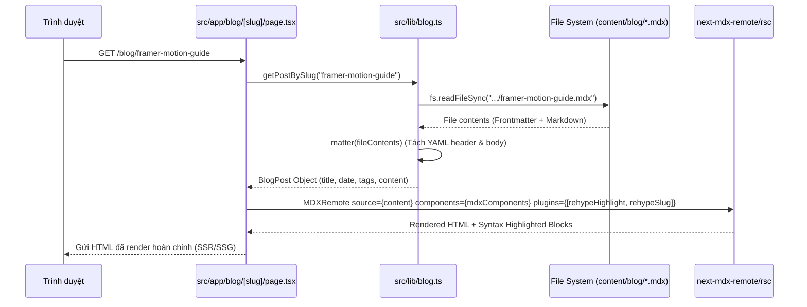

# 🏛️ Kiến Trúc Hệ Thống (Architecture Documentation)

Tài liệu này mô tả chi tiết kiến trúc kỹ thuật, luồng dữ liệu, các phân hệ (subsystems) và nguyên tắc thiết kế của dự án Portfolio.

---

## 1. Tổng Quan Kiến Trúc (Architecture Overview)

Dự án được xây dựng dựa trên **Next.js 14 App Router** với ngôn ngữ **TypeScript** ở chế độ `strict: true`.


---

## 2. Cấu Trúc Thư Mục (Directory Structure)

```
portfolio/
├── .claude/                   # Cấu hình IDE / Claude Code
│   └── settings.local.json
├── content/                   # Dữ liệu nội dung tĩnh ngoài source code
│   └── blog/                  # Các bài viết blog định dạng .mdx
│       ├── framer-motion-guide.mdx
│       └── react-three-fiber-guide.mdx
├── docs/                      # Tài liệu chi tiết của dự án
│   ├── ARCHITECTURE.md        # Kiến trúc hệ thống (file này)
│   ├── FEATURES.md            # Đặc tả chi tiết các tính năng
│   ├── CUSTOMIZATION_GUIDE.md # Hướng dẫn tùy biến nội dung & giao diện
│   └── DEPLOYMENT.md          # Hướng dẫn build và deploy
├── public/                    # Static assets (hình ảnh, icons, resume.pdf)
├── src/                       # Toàn bộ mã nguồn ứng dụng
│   ├── app/                   # Next.js App Router (Routes & Layouts)
│   │   ├── blog/              # Routes trang Blog & chi tiết bài viết
│   │   │   ├── [slug]/page.tsx
│   │   │   └── page.tsx
│   │   ├── contra/            # Route game Contra arcade
│   │   │   └── page.tsx
│   │   ├── couple/            # Route trang kỷ niệm tình yêu
│   │   │   ├── couple.module.css
│   │   │   ├── layout.tsx
│   │   │   └── page.tsx
│   │   ├── tools/             # Route các công cụ tiện ích
│   │   │   └── json-validator/
│   │   │       └── page.tsx
│   │   ├── globals.css        # Tailwind v4 configuration, theme variables (dark + light) & utilities
│   │   ├── layout.tsx         # Root layout chung (Nav, Main, Footer, Fonts, THEME_INIT_SCRIPT chống nháy theme)
│   │   └── page.tsx           # Trang chủ Portfolio (One-page scroll)
│   ├── components/            # React Components
│   │   ├── 3d/                # Three.js / React Three Fiber components
│   │   │   ├── FloatingTechStack.tsx
│   │   │   ├── Hero3DScene.tsx
│   │   │   ├── ParticleField.tsx
│   │   │   ├── SceneContainer.tsx
│   │   │   └── index.ts
│   │   ├── blog/              # Components dành cho blog
│   │   │   └── BlogList.tsx
│   │   ├── game/              # Canvas Game Engine
│   │   │   └── ContraGame.tsx
│   │   ├── sections/          # Các section của trang Portfolio chính
│   │   │   ├── AboutSection.tsx
│   │   │   ├── ContactSection.tsx
│   │   │   ├── HeroSection.tsx
│   │   │   ├── ProjectsSection.tsx
│   │   │   ├── SkillsSection.tsx
│   │   │   └── index.ts
│   │   ├── tools/             # Components cho công cụ dev
│   │   │   └── JsonValidator.tsx
│   │   └── ui/                # Reusable UI primitives
│   │       ├── AnimatedSection.tsx
│   │       ├── Button.tsx
│   │       ├── Footer.tsx
│   │       ├── GlassCard.tsx
│   │       ├── Navigation.tsx
│   │       ├── ThemeToggle.tsx  # Nút chuyển Light/Dark (mặt trăng/mặt trời)
│   │       ├── TiltCard.tsx
│   │       └── index.ts
│   ├── context/                # React Context providers toàn site
│   │   └── ThemeContext.tsx    # ThemeProvider + useTheme() — quản lý data-theme trên <html>
│   └── lib/                   # Utilities, types, constants, logic
│       ├── animations.ts      # Framer Motion animation variants
│       ├── blog.ts            # MDX file reader & parser (Server-only)
│       ├── constants.ts       # Central source of truth cho data & siteConfig (bao gồm EXCLUDED_ROUTE_PREFIXES cho theme)
│       ├── types.ts           # TypeScript interfaces & domain models
│       └── utils.ts           # Helper functions (cn helper: clsx + tailwind-merge)
├── CLAUDE.md                  # Hướng dẫn tác vụ dành cho AI Agents / Claude
├── eslint.config.mjs          # Cấu hình ESLint (FlatCompat)
├── next.config.js             # Cấu hình Next.js
├── package.json               # Dependencies & scripts
├── README.md                  # Tài liệu tổng quan dự án
└── tsconfig.json              # Cấu hình TypeScript compiler
```

---

## 3. Các Phân Hệ Chính (Core Subsystems)

### 3.1. 3D WebGL Pipeline (`src/components/3d`)

Phân hệ 3D được xây dựng dựa trên `@react-three/fiber` (R3F), `@react-three/drei` và `three`:

1. **`SceneContainer.tsx` (Wrapper Chuẩn)**:
   - Quản lý khởi tạo `<Canvas>` của Three.js với cấu hình camera tối ưu.
   - **Tự động nhận diện `prefers-reduced-motion`**: Nếu người dùng bật chế độ giảm chuyển động trong hệ điều hành, hệ thống sẽ render Fallback CSS gradient thay vì khởi động WebGL context để tiết kiệm GPU và bảo vệ trải nghiệm người dùng.
   - **`SceneErrorBoundary`**: Bọc toàn bộ 3D scene trong một Error Boundary cấp component. Khi WebGL bị crash hoặc driver GPU không hỗ trợ, màn hình sẽ fallback an toàn mà không làm sập toàn bộ trang web.

2. **Hiệu Suất & Mouse Tracking Không Gây Re-render**:
   - `HeroSection.tsx` sử dụng `useRef` dạng Mutable Object (`mousePositionRef.current = { x, y }`) để lắng nghe sự kiện `onMouseMove`.
   - `Hero3DScene.tsx` đọc trực tiếp giá trị này trong vòng lặp `useFrame((state, delta) => ...)` của Three.js.
   - **Kết quả**: Vị trí chuột được cập nhật mượt mà 60–120 FPS ở tầng GPU/Canvas mà không kích hoạt chu kỳ re-render của React DOM.

3. **Hệ Thống Hạt (`ParticleField.tsx`)**:
   - Sử dụng `THREE.BufferGeometry` với 500 điểm hạt (particle vertices) được cấp phát một lần duy nhất vào bộ nhớ Float32Array.
   - Vị trí các hạt được biến đổi bằng hàm sóng hình sin/cosin trong `useFrame`.

---

### 3.2. MDX Blog Engine (`content/blog` & `src/lib/blog.ts`)

Hệ thống blog hoạt động theo mô hình Server-Side MDX Compilation:



- **Static Generation (`generateStaticParams`)**: Tự động sinh static HTML tại thời điểm build cho toàn bộ các file `.mdx` trong `content/blog/`.
- **Dynamic SEO (`generateMetadata`)**: Tự động trích xuất tiêu đề, mô tả và OpenGraph metadata từ Frontmatter.
- **Custom MDX Components**: Ghi đè toàn bộ các thẻ HTML cơ bản (`h1`-`h3`, `p`, `a`, `pre`, `code`, `blockquote`) bằng giao diện glassmorphic tối đồng bộ với theme của ứng dụng.

---

### 3.3. Canvas 2D Game Loop Engine (`src/components/game/ContraGame.tsx`)

Trang `/contra` chứa một game engine 2D Contra arcade độc lập ~1.800 dòng code:

- **Game Loop (`requestAnimationFrame`)**: Chạy độc lập với React state, cập nhật vật lý theo delta time chuẩn xác.
- **Phân tách Layer**:
  1. *Input Layer*: Lắng nghe bàn phím (WASD / Mũi tên, J bắn, K nhảy, L dash/grenade, Enter/P pause).
  2. *Physics & Collision Layer*: Hệ thống AABB (Axis-Aligned Bounding Box) kiểm tra va chạm giữa Player, Quái, Đạn và Nền tảng (Platform).
  3. *Entity Management*: Quản lý danh sách đối tượng linh động (Players, Enemies, Bullets, Particles, PowerUps).
  4. *Render Layer*: Vẽ trực tiếp lên HTML5 Canvas 2D Context, áp dụng hiệu ứng CRT scanline, ánh sáng nổ, khói và mảnh văng particle.
- **Tích hợp Next.js**: Được bọc qua `next/dynamic` với `{ ssr: false }` và kiểm tra trạng thái `mounted` để tránh lỗi Hydration mismatch do phụ thuộc vào `window` và `HTMLCanvasElement`.

---

### 3.4. JSON Parameter Validator (`src/components/tools/JsonValidator.tsx`)

Công cụ kiểm tra tính toàn vẹn dữ liệu JSON:

- **Matching Theo Quy Ước Suffix**: Tự động ghép cặp các file `tb_def_exception_parameter_<suffix>.json` và `tb_def_parameter_<suffix>.json`.
- **Client-Side File Processing**: Đọc và parse dữ liệu hoàn toàn trên trình duyệt thông qua `FileReader` API, đảm bảo an toàn dữ liệu và tốc độ xử lý tức thì cho file dung lượng lớn.
- **Xác Thực Khóa**: Kiểm tra danh sách `tb_def_parameter__id` trong file exception có tồn tại tương ứng trong file parameter hay không, thống kê chi tiết các ID bị thiếu và hỗ trợ xuất báo cáo JSON.

---

### 3.5. Hệ Thống Design System & Animation (`src/app/globals.css`, `src/lib/design-tokens.ts`, `src/lib/ui-presets.ts`, `src/lib/animations.ts`)

- **Tailwind CSS v4**: Cấu hình theme trực tiếp qua `@theme inline` và biến CSS Custom Properties (`--background: #050505`, `--foreground`, `--purple-500`, `--cyan-500`).
- **Design Tokens (nguồn chân lý cho màu & kích thước dùng chung)** — chi tiết tại [`docs/DESIGN_TOKENS.md`](DESIGN_TOKENS.md):
  - `globals.css` khai báo thang màu thương hiệu (`--purple-400/500/600`, `--cyan-400/500/600`) và mọi hiệu ứng CSS thuần (gradient, glow, scrollbar, focus ring, selection, palette code block `--code-*`) đều đọc từ đó.
  - `src/lib/design-tokens.ts` export token đơn lẻ cho phía TSX: `surface.*`, `border.*`, `text.*`, `status.*`, `brand.*`, `radius.*`, `layout.*`, `gap.*`, `iconSize.*`, `motion.*`, `elevation.*`, `zIndex.*`, `focus.*`, `heading.*`. Mỗi token đã kèm sẵn biến thể `light:`; token hậu tố `Dark` không kèm, dành cho route trong `EXCLUDED_ROUTE_PREFIXES`.
  - `src/lib/ui-presets.ts` ghép token thành công thức hoàn chỉnh (`presets.card`, `presets.input`, `presets.inputDark`, `presets.badge.*`, `presets.section`...). `<GlassCard />` và `<Button />` đã dựng trên lớp này.
  - Nguyên tắc: giá trị dùng ở từ 3 component trở lên thì đưa vào token, đặt tên theo **vai trò** (`radius.card`) chứ không theo giá trị. Luôn ghép bằng `cn()` để class thêm vào ghi đè được token.
- **Standardized Micro-Animations**:
  - `fadeInUp`, `fadeInDown`, `fadeInLeft`, `fadeInRight`: Xuất hiện với độ trễ chuyển động mượt mà.
  - `staggerContainer`: Điều phối xuất hiện lần lượt cho các danh sách (skills, project cards).
  - `blurFadeIn`: Hiệu ứng mờ dần kết hợp scale sang trọng.
  - `tilt`: Hiệu ứng nghiêng thẻ 3D theo con trỏ chuột (`TiltCard.tsx`).

---

### 3.6. Hệ Thống Chế Độ Sáng/Tối (`src/context/ThemeContext.tsx`, `src/components/ui/ThemeToggle.tsx`)

Giao diện gốc của site là **Dark** (không đổi); Light mode được thêm vào dưới dạng lớp phủ **cộng thêm**, không phải đảo ngược từng class:

- **Biến thể Tailwind tuỳ biến**: `globals.css` khai báo `@custom-variant light (&:where([data-theme="light"], [data-theme="light"] *));` — mọi class tiền tố `light:` chỉ có hiệu lực khi `<html>` (hoặc tổ tiên gần nhất) có `data-theme="light"`. Component chỉ cần **thêm** class `light:` bên cạnh class dark gốc, không xoá/thay class cũ.
- **`ThemeProvider`** (bọc toàn app ở `layout.tsx`, bên trong `<script>` chống nháy theme): phát hiện theme ưu tiên qua `localStorage["portfolio_theme"]`, fallback `prefers-color-scheme`; tiếp tục lắng nghe sự kiện đổi theme OS nếu người dùng chưa từng chọn thủ công. Ghi `data-theme` lên `document.documentElement` mỗi khi theme đổi.
- **Chống FOUC (Flash of Unstyled/Incorrect Content)**: một inline script chặn render trong `layout.tsx` (`THEME_INIT_SCRIPT`) chạy **trước khi React hydrate**, set sẵn `data-theme` bằng đúng logic của `ThemeContext.tsx` — 2 nơi này bắt buộc đồng bộ.
- **Route ngoại lệ luôn Dark**: `EXCLUDED_ROUTE_PREFIXES` (`src/lib/constants.ts`) = `/admin`, `/contra`, `/couple` — `resolvedTheme` bị ép về `"dark"` bất kể lựa chọn người dùng khi đang ở các route này.
- **Ngoại lệ theo component**: modal `PhotoLightboxModal.tsx` trong module Photography chủ đích luôn Dark ("theater mode"), độc lập với theme hiện tại của trang.
- Design tokens theo theme (`--background`, `--foreground`, `--glass-bg`, `--glow-purple-color`, `--glow-cyan-color`, `--scrollbar-*`, `--selection-*`) được định nghĩa lại trong khối `[data-theme="light"]` — các utility Tailwind theo token (`bg-background`, `text-foreground`) tự đổi màu mà **không** cần tiền tố `light:`.

---

### 3.7. Điều Hướng & Cuộn Trang (`src/components/ui/Navigation.tsx`)

- **Breakpoint pill nav**: menu ngang dạng pill (desktop) chuyển sang hamburger (mobile) tại breakpoint Tailwind `lg` (**1024px**). Vì 7 nhãn tiếng Việt + logo + cụm control bên phải (theme toggle, language switcher, nút "Liên hệ ngay") không vừa 1 dòng ở khoảng 1024–1279px với padding/gap mặc định, phần pill (gap giữa item, padding mỗi item, gap cụm control phải, padding nút CTA) đã được thu gọn để vừa khít trong khoảng ~976px nội dung khả dụng tại 1024px — xem class `gap-1`, `px-2`, `px-2.5`, `gap-2` trong component.
- **Cơ chế đệm section cho việc cuộn tới mục (scroll-to-section padding)**: các section lớn trên trang chủ (`About`, `Skills`, `Projects`, `PhotoPreview`, `BlogPreview`, `Contact`) dùng `pt-8` (đệm nhỏ, cố định) thay vì `py-*` đối xứng. Phần khoảng trắng lớn còn lại được dồn sang `pb-*` của section **đứng trước đó** trong chuỗi hiển thị (`page.tsx`), giữ nguyên tổng khoảng cách giữa 2 section liền kề như thiết kế gốc — chỉ đổi "chủ sở hữu" khoảng đệm. Nhờ vậy khi bấm menu nhảy tới 1 section (`handleNavClick`), trang cuộn thẳng tới nội dung thay vì dừng lại giữa 1 khoảng trắng ở đầu section.
  - Riêng `HeroSection` không tham gia cơ chế trên vì có nền `bg-background` đặc (che phía sau canvas hố đen) — nếu cộng thêm `pb-*` trực tiếp vào section này, phần đệm sẽ vô tình che luôn nền sao toàn site (`GlobalBackground`/`StarryBackground3D`, `fixed -z-10`) phía sau, tạo một dải đen "chết" không có hiệu ứng gì khi cuộn. Khoảng cách Hero → About vì vậy được tạo bằng 1 `<div className="h-48" />` (transparent spacer) đặt trực tiếp trong `page.tsx`, nằm ngoài box đặc của Hero.
  - `HeroSection` có padding riêng biệt (`py-20 lg:py-0`) chỉ để tạo khoảng thở cho nội dung (badge/heading/mô tả/nút) trên màn hình ≤1024px khi text xuống nhiều dòng hơn — không liên quan tới cơ chế nối tiếp section ở trên.
- **Race điều kiện với Framer Motion khi đóng mobile menu**: đóng menu mobile (`AnimatePresence` animate `height: 0 → auto`) khiến Framer Motion tạm thời gọi `window.scrollTo(0, 0)` nội bộ để đo layout (`measureAllKeyframes`) rồi phục hồi lại vị trí cuộn cũ. Nếu `handleNavClick` gọi `window.scrollTo({ top, behavior: "smooth" })` ngay trong cùng tick với `setIsMobileMenuOpen(false)`, lệnh đo của Framer chạy sau đó sẽ ghi đè/huỷ animation cuộn, khiến trang bật ngược về đầu (0) thay vì tới đúng section. Cách khắc phục: dời lệnh `scrollTo` thật sự vào trong `requestAnimationFrame` lồng đôi, chạy sau khi Framer hoàn tất chu kỳ đo — cần nhớ pattern này nếu sau này thêm animation layout mới đi kèm scroll thủ công trong `Navigation.tsx`.

---

## 4. Quản Lý Trạng Thái & Luồng Dữ Liệu (State Management)

| Thành phần | Cơ chế State | Mục đích |
|---|---|---|
| **Single Source of Truth** | `src/lib/constants.ts` | Lưu trữ cấu hình toàn site (`siteConfig`), danh sách kỹ năng, dự án, liên kết mạng xã hội |
| **Contact Form** | `react-hook-form` + `zod` | Validation form liên hệ theo schema nghiêm ngặt, quản lý trạng thái submit và hiển thị thông báo |
| **Blog Filter** | React Local State (`useState`) | Lọc danh sách bài viết theo danh mục (category) tức thì tại Client |
| **3D Animations** | `useRef` + Three.js `useFrame` | Truyền tọa độ chuột trực tiếp vào GPU loop, tránh re-render React DOM |
| **2D Arcade Game** | Internal Engine State + Refs | Vòng lặp game độc lập 60 FPS, chỉ tương tác với React khi Pause / Game Over |
| **JSON Validator** | React Local State (`useState`) | Quản lý danh sách file upload, kết quả phân tích và bộ lọc lỗi |
| **Light/Dark Theme** | React Context (`ThemeContext`) + `localStorage` + `data-theme` attribute | Đồng bộ theme giữa inline blocking script, Context và CSS (`light:` variant), loại trừ theo route (`EXCLUDED_ROUTE_PREFIXES`) |

---

## 5. Tiêu Chuẩn Hiệu Năng & SEO (Performance & SEO)

1. **Tối Ưu Font**: Sử dụng `next/font/google` nạp `Inter` và `Space Grotesk` với cơ chế zero layout shift (font display swap).
2. **Dynamic Imports**: Tất cả các component nặng (Three.js WebGL, 2D Canvas Game) đều được tải bất đồng bộ theo cơ chế lazy loading (`next/dynamic` với `ssr: false`).
3. **Semantic HTML & Metadata**:
   - Thẻ `<h1>` duy nhất trên trang chủ, phân cấp `<h2>`-`<h4>` rõ ràng.
   - Hỗ trợ đầy đủ OpenGraph và Twitter Card metadata trên toàn bộ các route.
   - Thẻ `<html className="scroll-smooth">` hỗ trợ cuộn mượt mà giữa các section.
