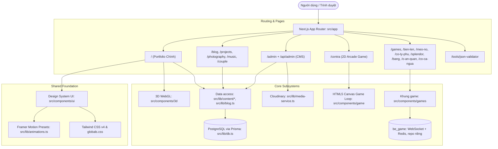
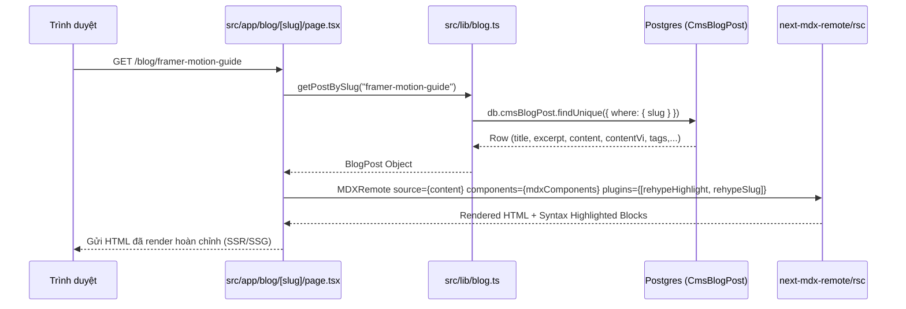

# 🏛️ Kiến Trúc Hệ Thống (Architecture Documentation)

Tài liệu này mô tả chi tiết kiến trúc kỹ thuật, luồng dữ liệu, các phân hệ (subsystems) và nguyên tắc thiết kế của dự án Portfolio.

---

## 1. Tổng Quan Kiến Trúc (Architecture Overview)

Dự án được xây dựng dựa trên **Next.js 14 App Router** với ngôn ngữ **TypeScript** ở chế độ `strict: true`.


```mermaid
graph TD
    User([Người dùng / Trình duyệt]) --> AppRouter[Next.js App Router: src/app]

    subgraph "Routing & Pages"
        AppRouter --> HomeRoute["/ (Portfolio Chính)"]
        AppRouter --> ContentRoutes["/blog, /projects, /photography, /music, /couple"]
        AppRouter --> AdminRoute["/admin + /api/admin (CMS)"]
        AppRouter --> ContraRoute["/contra (2D Arcade Game)"]
        AppRouter --> GamesRoute["/games, /tien-len, /meo-no, /co-ty-phu, /splendor, /bang, /o-an-quan, /co-ca-ngua"]
        AppRouter --> ToolRoute["/tools/json-validator"]
    end

    subgraph "Core Subsystems"
        HomeRoute --> ThreeEngine[3D WebGL: src/components/3d]
        HomeRoute --> ContentLib[Data access: src/lib/content/*, src/lib/blog.ts]
        ContentRoutes --> ContentLib
        AdminRoute --> ContentLib
        ContentLib --> DB[(PostgreSQL via Prisma: src/lib/db.ts)]
        AdminRoute --> Media[Cloudinary: src/lib/media-service.ts]
        ContraRoute --> CanvasEngine[HTML5 Canvas Game Loop: src/components/game]
        GamesRoute --> GamesShell[Khung game: src/components/games]
        GamesShell --> BeGame[(be_game: WebSocket + Redis, repo riêng)]
    end

    subgraph "Shared Foundation"
        HomeRoute --> UIComp[Design System UI: src/components/ui]
        UIComp --> AnimLib[Framer Motion Presets: src/lib/animations.ts]
        UIComp --> Styling[Tailwind CSS v4 & globals.css]
    end
```

---

## 2. Cấu Trúc Thư Mục (Directory Structure)

Chỉ liệt kê thư mục và file chính:

```
portfolio/
├── content/                   # Dữ liệu cũ (blog/*.mdx, data/*.json) — chỉ là nguồn cho scripts/migrate-json-to-db.ts
├── docs/                      # ARCHITECTURE, FEATURES, CUSTOMIZATION_GUIDE, DEPLOYMENT, MEONO_/BANG_ART_PROMPTS
├── prisma/schema.prisma       # Schema Postgres (model Cms*, Track/Playlist,...)
├── public/                    # Static assets (fonts/, games/splendor/{cards,nobles,gems}/*.webp, games/<game>/cards/*.webp khi có art)
├── scripts/
│   ├── card-art.mjs           # npm run art:meono / art:bang — art/<game>/*.png → public/games/<game>/cards/*.webp + src/lib/<game>/art.ts
│   └── migrate-json-to-db.ts  # Migrate 1 lần content/ → Postgres
├── src/
│   ├── app/                   # Next.js App Router
│   │   ├── page.tsx           # Trang chủ (Hero → About → Skills → Projects → PhotoPreview → BlogPreview → Contact)
│   │   ├── layout.tsx         # Root layout (Theme/Language/Music providers, GlobalBackground, Navigation, Footer, GlobalMusicPlayer, THEME_INIT_SCRIPT)
│   │   ├── not-found.tsx      # 404 (nền hố đen)
│   │   ├── globals.css        # Tailwind v4, theme tokens (dark + light), utilities
│   │   ├── admin/             # CMS: blog, couple, media, music, nav-links, photography, projects, site-config, skills, social-links, login
│   │   ├── api/               # admin/**, contact, couple, music/{tracks,upload}
│   │   ├── blog/, projects/, photography/ (+ album/[slug]), music/, couple/, contra/, tools/json-validator/
│   │   ├── games/             # Trang tổng các game
│   │   └── tien-len/, meo-no/, co-ty-phu/, splendor/, bang/, o-an-quan/, co-ca-ngua/   # layout.tsx (GamesShell) + page.tsx (sảnh) + [room]/page.tsx (bàn)
│   ├── components/
│   │   ├── 3d/                # SceneContainer, ParticleField, StarryBackground3D, blackhole/ (BlackHoleCanvas + engine)
│   │   ├── admin/, blog/, music/, photography/, projects/, sections/, tools/, layout/ (GlobalBackground)
│   │   ├── ui/                # Button, GlassCard, TiltCard, AnimatedSection, Navigation, Footer, Skeleton, ImageWithSkeleton, ThemeToggle, LanguageSwitcher, Icon,...
│   │   ├── game/              # ContraGame.tsx
│   │   ├── games/             # Khung chung game online (xem §3.8)
│   │   └── tienlen/, meono/, typhu/, splendor/, bang/, oanquan/, cangua/   # Bàn chơi từng game
│   ├── context/               # LanguageContext, MusicContext, ThemeContext, ToastContext
│   ├── generated/prisma/      # Prisma client (sinh bởi prisma generate, gitignored)
│   ├── lib/
│   │   ├── db.ts              # Prisma singleton (pg Pool + @prisma/adapter-pg)
│   │   ├── content/*.ts       # Đọc/ghi từng loại nội dung (unstable_cache cho đọc public)
│   │   ├── blog.ts, admin-auth.ts, session-token.ts, cloudinary.ts, media-service.ts, rate-limit.ts, seo.ts
│   │   ├── constants.ts       # EXCLUDED_ROUTE_PREFIXES (route luôn dark)
│   │   ├── animations.ts, types.ts, utils.ts, content-overrides.ts, section-defaults.ts
│   │   └── tienlen/, meono/, typhu/, splendor/, bang/, oanquan/, cangua/   # Bản sao dữ liệu/luật + protocol của be_game
│   ├── locales/               # en.ts, vi.ts
│   └── middleware.ts          # Chặn /admin khi chưa đăng nhập
├── CLAUDE.md, README.md
├── eslint.config.mjs, next.config.js, prisma.config.ts, tsconfig.json, package.json
└── .env.example               # Danh sách biến môi trường
```

---

## 3. Các Phân Hệ Chính (Core Subsystems)

### 3.1. 3D WebGL Pipeline (`src/components/3d`)

Phân hệ 3D được xây dựng dựa trên `@react-three/fiber` (R3F), `@react-three/drei` và `three`:

1. **`SceneContainer.tsx` (Wrapper Chuẩn)**:
   - Quản lý khởi tạo `<Canvas>` của Three.js với cấu hình camera tối ưu.
   - **Tự động nhận diện `prefers-reduced-motion`**: Nếu người dùng bật chế độ giảm chuyển động trong hệ điều hành, hệ thống sẽ render Fallback CSS gradient thay vì khởi động WebGL context để tiết kiệm GPU và bảo vệ trải nghiệm người dùng.
   - **`SceneErrorBoundary`**: Bọc toàn bộ 3D scene trong một Error Boundary cấp component. Khi WebGL bị crash hoặc driver GPU không hỗ trợ, màn hình sẽ fallback an toàn mà không làm sập toàn bộ trang web.
   - Dùng cho `StarryBackground3D` (nền sao toàn site qua `GlobalBackground`) và `ParticleField` của Contact.

2. **Hố đen Hero (`blackhole/BlackHoleCanvas.tsx`)** — ngoại lệ không đi qua `SceneContainer`:
   - Engine raymarching Schwarzschild tự quản lý `THREE.WebGLRenderer` + vòng lặp riêng (không phải R3F), tự co giãn theo phần tử cha (`ResizeObserver`), tôn trọng `prefers-reduced-motion`.
   - Hero dùng chế độ trang trí (`interactive={false}`, `scrollEffect`): camera nghiêng/zoom dần theo vị trí cuộn của cả trang; sự kiện cuộn được throttle bằng `requestAnimationFrame` và cập nhật thẳng vào engine, không qua React state. Trang 404 dùng cùng engine.

3. **Hệ Thống Hạt (`ParticleField.tsx`)**:
   - `Float32Array` vị trí/vận tốc cấp phát một lần theo `count` (mặc định 1000; Contact dùng 500, hoặc 200 trên máy yếu), cập nhật trong `useFrame`.

---

### 3.2. MDX Blog Engine (`src/lib/blog.ts`, bảng `CmsBlogPost`)

Hệ thống blog hoạt động theo mô hình Server-Side MDX Compilation:


```mermaid
sequenceDiagram
    participant User as Trình duyệt
    participant Page as src/app/blog/[slug]/page.tsx
    participant Lib as src/lib/blog.ts
    participant DB as Postgres (CmsBlogPost)
    participant MDX as next-mdx-remote/rsc

    User->>Page: GET /blog/framer-motion-guide
    Page->>Lib: getPostBySlug("framer-motion-guide")
    Lib->>DB: db.cmsBlogPost.findUnique({ where: { slug } })
    DB-->>Lib: Row (title, excerpt, content, contentVi, tags,...)
    Lib-->>Page: BlogPost Object
    Page->>MDX: MDXRemote source={content} components={mdxComponents} plugins={[rehypeHighlight, rehypeSlug]}
    MDX-->>Page: Rendered HTML + Syntax Highlighted Blocks
    Page-->>User: Gửi HTML đã render hoàn chỉnh (SSR/SSG)
```

- **Static Generation (`generateStaticParams`)**: Sinh static HTML lúc build cho mọi slug có trong DB; bài được tạo/sửa ở `/admin/blog` (admin API gọi `revalidateTag("blog")`).
- **Dynamic SEO (`generateMetadata`)**: Tiêu đề, mô tả và OpenGraph lấy từ dữ liệu bài viết.
- `content/blog/*.mdx` chỉ còn là nguồn cho `scripts/migrate-json-to-db.ts`.
- **Custom MDX Components**: Ghi đè toàn bộ các thẻ HTML cơ bản (`h1`-`h3`, `p`, `a`, `pre`, `code`, `blockquote`) bằng giao diện glassmorphic tối đồng bộ với theme của ứng dụng.

---

### 3.3. Canvas 2D Game Loop Engine (`src/components/game/ContraGame.tsx`)

Trang `/contra` chứa một game engine 2D Contra arcade độc lập ~1.800 dòng code:

- **Game Loop (`requestAnimationFrame`)**: Chạy độc lập với React state, cập nhật vật lý theo delta time chuẩn xác.
- **Phân tách Layer**:
  1. *Input Layer*: Lắng nghe bàn phím (A/D hoặc ←/→ di chuyển, W/↑ ngắm lên, S/↓ nằm, Space/W/↑ nhảy, ↓+Space rơi qua cầu, J/Z/X bắn, Enter bắt đầu, Esc tạm dừng). Vòng lặp fixed-timestep `FIXED_DT = 1000/60`.
  2. *Physics & Collision Layer*: Hệ thống AABB (Axis-Aligned Bounding Box) kiểm tra va chạm giữa Player, Quái, Đạn và Nền tảng (Platform).
  3. *Entity Management*: Quản lý danh sách đối tượng linh động (Players, Enemies, Bullets, Particles, PowerUps).
  4. *Render Layer*: Vẽ trực tiếp lên HTML5 Canvas 2D Context, áp dụng hiệu ứng CRT scanline, ánh sáng nổ, khói và mảnh văng particle.
- **Tích hợp Next.js**: Được bọc qua `next/dynamic` với `{ ssr: false }` và kiểm tra trạng thái `mounted` để tránh lỗi Hydration mismatch do phụ thuộc vào `window` và `HTMLCanvasElement`.

---

### 3.4. JSON Parameter Validator (`src/components/tools/JsonValidator.tsx`)

Công cụ kiểm tra tính toàn vẹn dữ liệu JSON:

- **Matching Theo Quy Ước Suffix**: Tự động ghép cặp các file `tb_def_exception_parameter_<suffix>.json` và `tb_def_parameter_<suffix>.json`.
- **Client-Side File Processing**: Đọc và parse dữ liệu hoàn toàn trên trình duyệt thông qua `FileReader` API, đảm bảo an toàn dữ liệu và tốc độ xử lý tức thì cho file dung lượng lớn.
- **Xác Thực Khóa**: Kiểm tra danh sách `tb_def_parameter__id` trong file exception có tồn tại tương ứng trong file parameter hay không, thống kê chi tiết các ID bị thiếu và hỗ trợ xuất báo cáo JSON.

---

### 3.5. Hệ Thống Design System & Animation (`src/app/globals.css`, `src/lib/animations.ts`)

- **Tailwind CSS v4**: Cấu hình theme trực tiếp qua `@theme inline` và biến CSS Custom Properties (`--background: #050505`, `--foreground`, `--purple-500`, `--cyan-500`).
- **Standardized Micro-Animations**:
  - `fadeInUp`, `fadeInLeft`, `fadeInRight`, `scaleUp`: Xuất hiện với độ trễ chuyển động mượt mà.
  - `staggerContainer`: Điều phối xuất hiện lần lượt cho các danh sách (skills, project cards).
  - `blurFadeIn`: Hiệu ứng mờ dần kết hợp blur; `floatAnimation`: bay lên-xuống lặp vô hạn.
  - Nghiêng thẻ 3D theo con trỏ nằm trong component `TiltCard.tsx` (spring của Framer Motion), không phải variant.

---

### 3.6. Hệ Thống Chế Độ Sáng/Tối (`src/context/ThemeContext.tsx`, `src/components/ui/ThemeToggle.tsx`)

Giao diện gốc của site là **Dark** (không đổi); Light mode được thêm vào dưới dạng lớp phủ **cộng thêm**, không phải đảo ngược từng class:

- **Biến thể Tailwind tuỳ biến**: `globals.css` khai báo `@custom-variant light (&:where([data-theme="light"], [data-theme="light"] *));` — mọi class tiền tố `light:` chỉ có hiệu lực khi `<html>` (hoặc tổ tiên gần nhất) có `data-theme="light"`. Component chỉ cần **thêm** class `light:` bên cạnh class dark gốc, không xoá/thay class cũ.
- **`ThemeProvider`** (bọc toàn app ở `layout.tsx`, bên trong `<script>` chống nháy theme): phát hiện theme ưu tiên qua `localStorage["portfolio_theme"]`, fallback `prefers-color-scheme`; tiếp tục lắng nghe sự kiện đổi theme OS nếu người dùng chưa từng chọn thủ công. Ghi `data-theme` lên `document.documentElement` mỗi khi theme đổi.
- **Chống FOUC (Flash of Unstyled/Incorrect Content)**: một inline script chặn render trong `layout.tsx` (`THEME_INIT_SCRIPT`) chạy **trước khi React hydrate**, set sẵn `data-theme` bằng đúng logic của `ThemeContext.tsx` — 2 nơi này bắt buộc đồng bộ.
- **Route ngoại lệ luôn Dark**: `EXCLUDED_ROUTE_PREFIXES` (`src/lib/constants.ts`) = `/admin`, `/contra`, `/couple`, `/music`, `/games`, `/tien-len`, `/meo-no`, `/co-ty-phu`, `/splendor`, `/bang`, `/o-an-quan`, `/co-ca-ngua` — `resolvedTheme` bị ép về `"dark"` bất kể lựa chọn người dùng khi đang ở các route này.
- **Ngoại lệ theo component**: modal `PhotoLightboxModal.tsx` trong module Photography chủ đích luôn Dark ("theater mode"), độc lập với theme hiện tại của trang.
- Design tokens theo theme (`--background`, `--foreground`, `--glass-bg`, `--glow-purple-color`, `--glow-cyan-color`, `--scrollbar-*`, `--selection-*`) được định nghĩa lại trong khối `[data-theme="light"]` — các utility Tailwind theo token (`bg-background`, `text-foreground`) tự đổi màu mà **không** cần tiền tố `light:`.

---

### 3.7. Điều Hướng & Cuộn Trang (`src/components/ui/Navigation.tsx`)

- **Breakpoint pill nav**: menu ngang dạng pill (desktop) chuyển sang hamburger (mobile) tại breakpoint Tailwind `lg` (**1024px**). Vì 7 nhãn tiếng Việt + logo + cụm control bên phải (theme toggle, language switcher, nút "Liên hệ ngay") không vừa 1 dòng ở khoảng 1024–1279px với padding/gap mặc định, phần pill (gap giữa item, padding mỗi item, gap cụm control phải, padding nút CTA) đã được thu gọn để vừa khít trong khoảng ~976px nội dung khả dụng tại 1024px — xem class `gap-1`, `px-2`, `px-2.5`, `gap-2` trong component.
- **Cơ chế đệm section cho việc cuộn tới mục (scroll-to-section padding)**: các section lớn trên trang chủ (`About`, `Skills`, `Projects`, `PhotoPreview`, `BlogPreview`, `Contact`) dùng `pt-8` (đệm nhỏ, cố định) thay vì `py-*` đối xứng. Phần khoảng trắng lớn còn lại được dồn sang `pb-*` của section **đứng trước đó** trong chuỗi hiển thị (`page.tsx`), giữ nguyên tổng khoảng cách giữa 2 section liền kề như thiết kế gốc — chỉ đổi "chủ sở hữu" khoảng đệm. Nhờ vậy khi bấm menu nhảy tới 1 section (`handleNavClick`), trang cuộn thẳng tới nội dung thay vì dừng lại giữa 1 khoảng trắng ở đầu section.
  - Riêng `HeroSection` không tham gia cơ chế trên vì có nền `bg-background` đặc (che phía sau canvas hố đen) — nếu cộng thêm `pb-*` trực tiếp vào section này, phần đệm sẽ vô tình che luôn nền sao toàn site (`GlobalBackground`/`StarryBackground3D`, `fixed -z-10`) phía sau, tạo một dải đen "chết" không có hiệu ứng gì khi cuộn. Khoảng cách Hero → About vì vậy được tạo bằng 1 `<div className="h-48" />` (transparent spacer) đặt trực tiếp trong `page.tsx`, nằm ngoài box đặc của Hero.
  - `HeroSection` có padding riêng biệt (`py-20 lg:py-0`) chỉ để tạo khoảng thở cho nội dung (badge/heading/mô tả/nút) trên màn hình ≤1024px khi text xuống nhiều dòng hơn — không liên quan tới cơ chế nối tiếp section ở trên.
- **Race điều kiện với Framer Motion khi đóng mobile menu**: đóng menu mobile (`AnimatePresence` animate `height: 0 → auto`) khiến Framer Motion tạm thời gọi `window.scrollTo(0, 0)` nội bộ để đo layout (`measureAllKeyframes`) rồi phục hồi lại vị trí cuộn cũ. Nếu `handleNavClick` gọi `window.scrollTo({ top, behavior: "smooth" })` ngay trong cùng tick với `setIsMobileMenuOpen(false)`, lệnh đo của Framer chạy sau đó sẽ ghi đè/huỷ animation cuộn, khiến trang bật ngược về đầu (0) thay vì tới đúng section. Cách khắc phục: dời lệnh `scrollTo` thật sự vào trong `requestAnimationFrame` lồng đôi, chạy sau khi Framer hoàn tất chu kỳ đo — cần nhớ pattern này nếu sau này thêm animation layout mới đi kèm scroll thủ công trong `Navigation.tsx`.

---

### 3.8. Game Online (`src/components/games`, backend be_game)

- **Backend**: repo riêng **be_game** (Vercel serverless WebSocket + Redis). Client gọi `serverBase()` = `NEXT_PUBLIC_TIENLEN_SERVER_URL` (mặc định `http://localhost:4000`). Tiến Lên dùng `/api/ws`, `/api/rooms`, `/api/leaderboard`; các game khác dùng `/api/<game>/ws|rooms|leaderboard` với `<game>` = `meono`, `typhu`, `splendor`, `bang`, `oanquan`, `cangua`.
- **Layout**: `layout.tsx` của `/games` và mỗi game bọc trang trong `GamesShell` — thanh tab game, tên người chơi (đổi tên được), cổng chọn tên (chưa có tên thì hiện trước), `AllRoomsPanel` (cột phải ở hub/sảnh, poll `/rooms` của mọi game mỗi 10 giây) và footer gọn. `Navigation`/`Footer` của site tự ẩn trên các route này (`isGamesRoute()` trong `gamesRegistry.ts`, nơi khai báo danh sách game, route, endpoint `/rooms` và số ghế tối đa).
- **`gameClient.ts`**: WebSocket dùng chung (`useGameRoom`, `createGameRoom`, `fetchApi`) — ack, ping 10 giây (kiêm heartbeat), reconnect có backoff và chuyển kết nối khi server báo sắp hết thời gian function. Token ghế lưu `sessionStorage` (reload giữ ghế, mỗi tab là một người chơi); tên người chơi dùng chung mọi game ở `localStorage["games:playerName"]` (`getSavedName`/`saveName`/`usePlayerName`, key cũ `tienlen:name` được migrate). Trang bàn chơi cố định tên lúc mount.
- **Component dùng chung**: `GameLobby` (tạo/vào bàn bằng mã, danh sách bàn, xem, bảng xếp hạng, luật), `ChatBox` (chat nổi cho người chơi & khán giả), `DraggableHand` (tự xếp bài trên tay, chỉ lưu `sessionStorage`), `SettingsTabs` (tab cài đặt phòng chờ), `TurnIndicator` (`TurnRing` + `MyTurnBadge`), `RankPointsPicker` (chủ phòng chọn điểm Nhất/Nhì, các hạng còn lại đối xứng để tổng bằng 0).
- **Bản sao luật/dữ liệu**: `src/lib/{tienlen,meono,typhu,splendor,bang,oanquan,cangua}/` là bản sao từ be_game (`src/game/` cho Tiến Lên, `src/<game>/cards.ts` hoặc `board.ts` + `protocol.ts`) để kiểm tra nước đi và hiển thị ở client — sửa luật ở be_game thì phải đồng bộ lại.
- **Ảnh lá bài**: Đá Quý dùng ảnh WebP có sẵn trong `public/games/splendor/`. Mèo Nổ và Đấu Súng có art tùy chọn từng lá: ảnh nguồn đặt ở `art/<game>/` (gitignored) → `npm run art:meono` / `npm run art:bang` (`scripts/card-art.mjs`) → `public/games/<game>/cards/*.webp` + `src/lib/<game>/art.ts`; lá chưa có art giữ mặt vẽ bằng emoji. Prompt: `docs/MEONO_ART_PROMPTS.md`, `docs/BANG_ART_PROMPTS.md`.

---

### 3.9. Lớp Dữ Liệu (Prisma + PostgreSQL)

- `src/lib/db.ts`: Prisma client (sinh ở `src/generated/prisma`) với driver adapter `@prisma/adapter-pg`, singleton qua `globalThis`. `prisma.config.ts` đọc `DATABASE_URL`.
- Mọi nội dung (site config, nav/social links, skills, projects, ảnh/album, couple, media registry, blog, tin nhắn liên hệ) nằm ở các model `Cms*`, truy cập qua `src/lib/content/*.ts` và `src/lib/blog.ts`; Music dùng `Track`/`Playlist`/`PlaylistTrack`.
- Đọc public được cache bằng `unstable_cache`; route `/api/admin/**` kiểm tra `requireAdminSession()` rồi ghi DB và `revalidateTag(...)`.

---

## 4. Quản Lý Trạng Thái & Luồng Dữ Liệu (State Management)

| Thành phần | Cơ chế State | Mục đích |
|---|---|---|
| **Nội dung site** | Postgres (Prisma) qua `src/lib/content/*`, đọc ở Server Component rồi truyền props | Cấu hình site, kỹ năng, dự án, ảnh, liên kết, couple, blog — sửa qua `/admin` |
| **Contact Form** | `react-hook-form` + `zod` | Validation form liên hệ theo schema nghiêm ngặt, quản lý trạng thái submit và hiển thị thông báo |
| **Blog Filter** | React Local State (`useState`) | Lọc danh sách bài viết theo danh mục (category) tức thì tại Client |
| **3D Animations** | `useRef` + Three.js `useFrame` | Truyền tọa độ chuột trực tiếp vào GPU loop, tránh re-render React DOM |
| **2D Arcade Game** | Internal Engine State + Refs | Vòng lặp game độc lập 60 FPS, chỉ tương tác với React khi Pause / Game Over |
| **JSON Validator** | React Local State (`useState`) | Quản lý danh sách file upload, kết quả phân tích và bộ lọc lỗi |
| **Game online** | `useGameRoom` (WebSocket) + state phòng do server gửi | Server be_game là nguồn sự thật; client chỉ giữ tên, token ghế, thứ tự bài trên tay |
| **Light/Dark Theme** | React Context (`ThemeContext`) + `localStorage` + `data-theme` attribute | Đồng bộ theme giữa inline blocking script, Context và CSS (`light:` variant), loại trừ theo route (`EXCLUDED_ROUTE_PREFIXES`) |

---

## 5. Tiêu Chuẩn Hiệu Năng & SEO (Performance & SEO)

1. **Tối Ưu Font**: Sử dụng `next/font/google` nạp `Inter` và `Space Grotesk` với cơ chế zero layout shift (font display swap).
2. **Dynamic Imports**: Các component nặng (WebGL, Canvas game, các section dưới màn hình đầu) được tải bằng `next/dynamic` (WebGL/Canvas dùng `ssr: false`).
3. **Semantic HTML & Metadata**:
   - Thẻ `<h1>` duy nhất trên trang chủ, phân cấp `<h2>`-`<h4>` rõ ràng.
   - Hỗ trợ đầy đủ OpenGraph và Twitter Card metadata trên toàn bộ các route.
   - Thẻ `<html className="scroll-smooth">` hỗ trợ cuộn mượt mà giữa các section.
